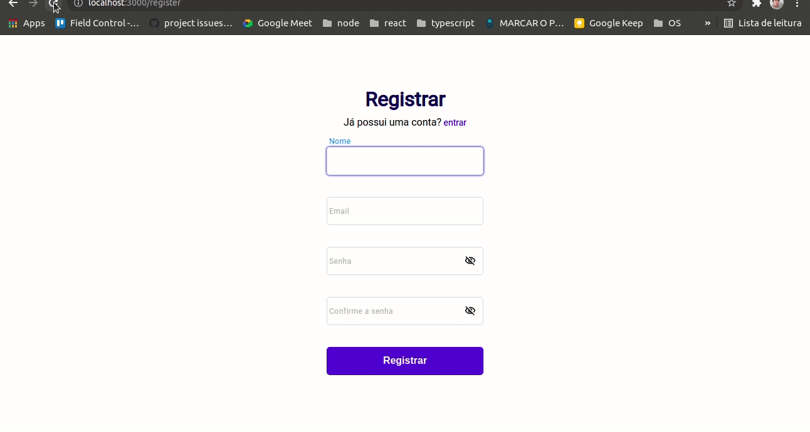
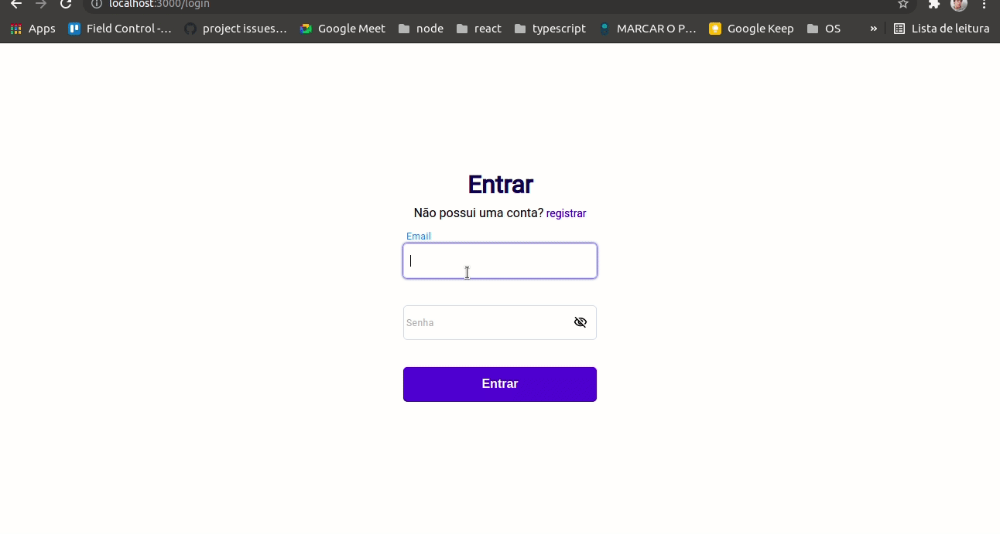
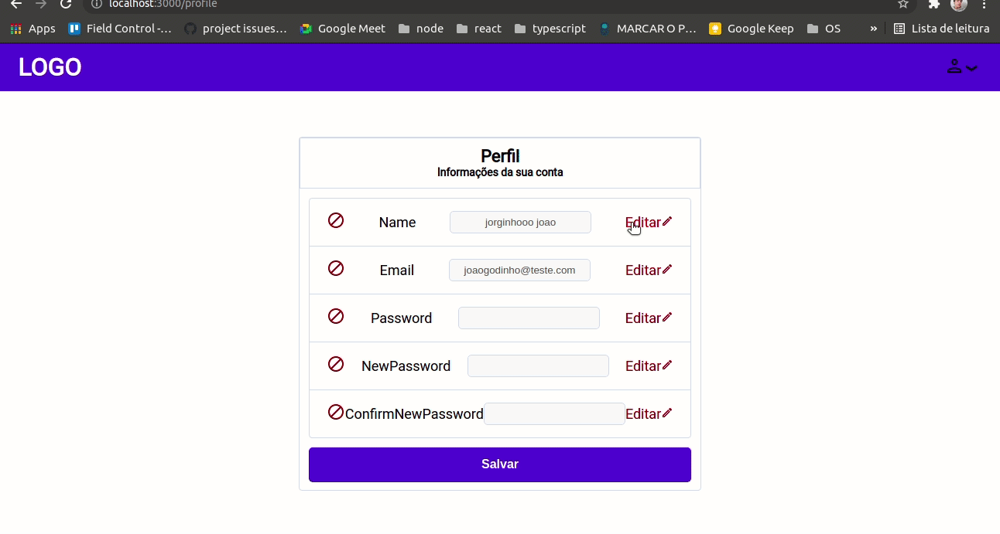

# Como o site funciona:

**Um pouco do que você vai perceber: validações no front e no back-end para todas as telas**

## Criando conta:

  

## Logando em uma conta:

  

## Editando uma conta:

  

# Sobre o projeto:

- Basicamente uma aplicação na qual você pode se cadastrar, entrar na sua conta, listar todos usuários, gerenciar sua conta ( editar ) e deslogar. Tudo isso conta com muitas tecnologias e diferentes conceitos.

- Um back-end feito em express, utilizando knex.js como query builder, jwt para autenticação e jest nos testes.
- Um front-end que consome a Api rest, feito em ReactJS, utilizando componentes funcionais com hooks.

# Qual propósito do projeto ?

### back-end

- Colocar em prática conhecimentos sobre REST APIs, além disso, confira meu repositório sobre Arquitetura Rest: https://github.com/godinhojoao/apresentacao-rest
- Colocar em prática conhecimentos sobre TDD, utilizando a lib jest para realizar os testes unitários e integrados.
- Criar uma arquitetura para tratar erros utilizando middlewares em express.

### front-end

- Aprender mais sobre ReactJS ( Componentes funcionais, Hooks, ContextAPI, entre outras coisas... )
- Colocar em prática conhecimentos sobre gerenciamento de formulários, utilizando Formik
- Criar validações no front-end utilizando Yup

# O que foi utilizado no projeto - Back-end?

- Rotas para gerenciar usuários ( CRUD )
- Rotas com autenticação
- Cobertura de testes, tanto unitários quanto integrados ( utilizando jest )
- Banco de dados relacional ( PostgreSQL): Para persistir dados
- bcrypt: Para criptografar as senhas antes de persistir as mesmas no banco de dados.s
- Knexjs: Para criar as queries no banco de dados
- Bcrypt: Para encriptar senhas
- Joi: Para validações
- http-errors: Para tratar erros
- jsonwebtoken: Para validações com tokens jwt

# O que foi utilizado no projeto - Front-end?

- ReactJS
- Axios: Para realizar requisições HTTP
- Formik: Para criar forms com reactjs
- Yup: Para validações de forms com reactjs
- SASS: Para estilizar as páginas
- react-alert: Para criar alertas em tela

# Primeiro rode o server e depois o client

- Para rodar o server entre no readme.md da pasta /server e siga os passos
- Para rodar o client entre no readme.md da pasta /client e siga os passos
